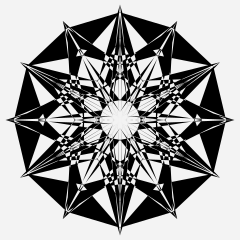

= mandala-wasm

Unique SVG mandalas procedurally generated in WebAssembly.

Demo application can be accessed https://mszyszko.com/projects/mandala-wasm/[here].

== Build

To build the project run the `make` command. Build output will be saved to `build` directory.

Run `make help` for build options.

== Run

Run a local web server with:

----
$ make run
----

or

----
$ python3 serve.py
----

== Acknowledgments

I was inspired by https://mathematica.stackexchange.com/questions/136974/code-that-generates-a-mandala[this] thread on stackexchange.

== Licence

MIT (see the link:LICENSE[LICENSE] file)
